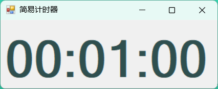

# WindowsFormsApp2（计时器）

这是一个学生根据自己需求编写的基于 Windows Forms 的轻量计时器应用（C# / .NET Framework 4.8）。应用支持正向/反向计时、记录运行日志、导出/清空日志、窗口置顶与简单的界面编辑。该仓库包含 Visual Studio 的解决方案和项目文件，适合在 Windows 平台下使用 Visual Studio 打开、编译和运行。

## 动机
市面上类似商品繁多，但是均过于庞杂，本项目仅专注于计时+记录，后续会根据个人需求开发多种统计/日志/...等便于增强个人学习能力和提供反馈的功能。同时添加置顶，建议计时开始后点击置顶并且缩小边界，悬挂于屏幕顶端。例如：

同时建议编译的可执行文件直接发送到桌面，并修改图标，例如：

## 主要功能
- 支持反向（倒计时）与正向（计时到目标）两种模式。
- 设置时/分/秒并开始/停止/重置计时。
- 运行事件记录到 `timer_log.txt`（位于应用程序目录/可执行文件目录）。
- 支持导出日志到任意路径以及清空日志。
- 窗口置顶开关、隐藏/显示编辑控件等简单 UI 操作。

## 项目结构（重要文件）
- `WindowsFormsApp2.sln` — Visual Studio 解决方案。
- `WindowsFormsApp2/WindowsFormsApp2.csproj` — 项目文件。
- `WindowsFormsApp2/Form1.cs` — 主窗体代码（计时逻辑、日志写入、按钮事件）。
- `WindowsFormsApp2/Form1.Designer.cs` — 窗体设计器生成的界面定义。
- `timer_log.txt` — 运行时生成的日志文件（位于 `WindowsFormsApp2/bin/Debug` 或可执行文件所在目录）。

## 运行环境与依赖
- Windows 操作系统。
- Visual Studio（推荐 2019/2022）或任何支持 .NET Framework 4.8 的 IDE。
- 目标框架：.NET Framework 4.8（请确保已安装相应运行时/开发包）。

## 快速开始（在 Windows 上）

1. 使用 Visual Studio 打开解决方案：双击根目录下的 `WindowsFormsApp2.sln`。
2. 在 Visual Studio 中选择 `Debug` 配置（或 `Release`），然后按 F5（调试）或 Ctrl+F5（无调试）运行。

或者直接运行可执行文件（示例使用 PowerShell）：

```powershell
cd "e:\ToDoList\WindowsFormsApp2\WindowsFormsApp2\bin\Debug"
.\WindowsFormsApp2.exe
```

运行后，应用会在其目录下生成并维护 `timer_log.txt` 日志文件，记录启动/停止/重置/结束等事件。

## 使用说明（界面与常见操作）
- 编辑计时：使用“时/分/秒”三个数值框设置时间。点击“编辑”按钮可隐藏或显示这些编辑控件。
- 模式选择：选择“正向计时”或“反向计时”。正向计时从 0 开始到达目标结束；反向计时从设定时间倒计时到 0。
- 开始/停止：点击“开始”启动计时，按钮会切换为“停止”以暂停计时。
- 重置：停止并恢复到编辑时设定的初始值。
- 置顶：切换窗体 TopMost 属性，让窗口保持在最上层。
- 日志导出：点击“导出日志”可将当前日志另存为文本文件。
- 清空日志：点击“清空日志”并确认后会清空 `timer_log.txt` 内容以及界面上的日志区。

## 日志文件
- 默认日志文件名：`timer_log.txt`。
- 存放位置：应用程序运行目录（例如 `WindowsFormsApp2\bin\Debug\timer_log.txt`）。
- 日志内容示例：
	- "2025.10.26 12:34:56 反向计时10分钟 标题"（时间戳 + 操作描述 + 可选标题）

## 后续开发与扩展建议
- 添加声音提示：在计时结束处调用 `System.Media.SystemSounds` 或 `SoundPlayer` 播放自定义音频。
- 支持最小化托盘：使用 `NotifyIcon` 将窗口最小化到系统托盘并在计时结束时弹出通知。
- 多语言支持：把界面字符串抽离到资源文件 (`.resx`) 并实现本地化。

## 已知问题与注意事项
- 日志写入采用简单的追加写入，异常时会在调试输出中记录，但不会阻止计时功能。
- 如果在不同用户或受限目录运行，日志写入可能失败（权限问题），建议将可执行放在用户有写权限的目录下或以管理员运行。

## 贡献与许可证
如果你想扩展此项目，可以提交 Pull Request 或在 Issues 中报告问题。本仓库未显式指定许可证，请在使用或发布前自行添加合适的许可证。

